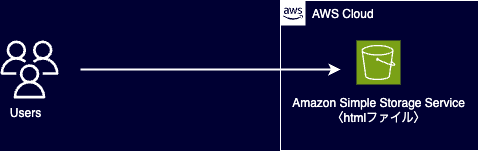

# Mission 1：S3静的Webサイト構築

## 1. シナリオ・要件

### シナリオ
AWSを利用して、静的なWebサイトを公開する。

### 要件
- Amazon S3を利用する
- HTMLファイルをS3にアップロードする
- S3の静的ウェブサイトホスティング機能を利用する
- インターネットからWebサイトへアクセスできるようにする

## 2. アーキテクチャ

## 3. 構築したAWSサービス

- Amazon S3

## 4. 学んだこと

- S3バケットの作成
- S3へのオブジェクトアップロード
- 静的Webサイトホスティング
- パブリックアクセス設定
- バケットポリシー
- S3静的Webサイトエンドポイント

## 5. 今後試したいこと

- AWS CLIを利用したS3操作
- CloudFrontによるHTTPS化
- Route 53による独自ドメイン設定