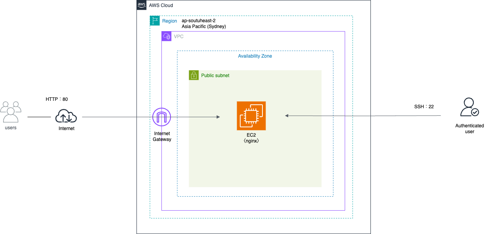

# Mission 2 - EC2 Web Server

## ① シナリオ・要件

### シナリオ

北海道のIT企業「Hokkaido IT Solutions」が、自社Webサイトを公開するためのWebサーバーをAWS上に構築する。

今回は、Amazon EC2上にAmazon Linux 2023を構築し、nginxをWebサーバーとして利用する。

AWSマネジメントコンソールでインフラを構築した後、SSHおよびAWS CLIを利用してサーバー・AWSリソースを操作する。

### 要件

- AWS上にWebサーバーを構築する
- EC2を利用する
- Amazon Linux 2023を使用する
- nginxをインストールしてWebサイトを公開する
- HTTP（80番ポート）でインターネットからアクセスできるようにする
- SSH（22番ポート）は自分のIPアドレスからのみ許可する
- MacからSSHでEC2へ接続できるようにする
- Macから`scp`でHTMLファイルをEC2へ転送する
- AWS CLIからEC2の情報を取得する

---

## ② アーキテクチャ



### 構成

- Region：Asia Pacific (Sydney) `ap-southeast-2`
- Availability Zone：1つのAZを利用
- VPC
- Public Subnet
- Internet Gateway
- Amazon EC2
- Amazon Linux 2023
- nginx
- Security Group
- SSH
- HTTP

### 通信

#### Webアクセス

```text
Internet
   ↓
Internet Gateway
   ↓
Public Subnet
   ↓
EC2
   ↓
nginx